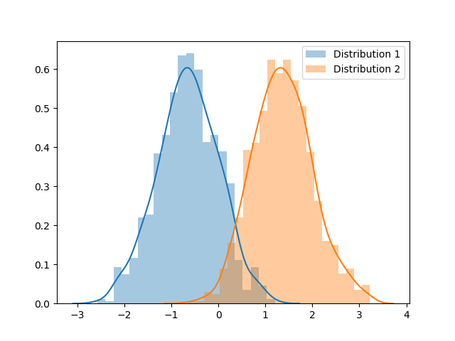

## PyStatCheck
A small python package to check whether a pair of samples (numpy arrays) come from the same distribution.
A typical use-case involves testing if a pair of sets of measurements/computed metrics belong to the same distribution. 
Especially useful to perform ablation studies. 

## Installation
* Clone the repository in a folder of your choice:
```
cd <FOLDER_OF_CHOICE>
git clone https://github.com/kilgore92/PyStatCheck.git
```

* Install dependencies
```
cd pystatcheck
<PATH_TO_PYTHON_ENV>/bin/pip install -r requirements.txt
```

* Install the package
```
<PATH_TO_PYTHON_ENV>/bin/python setup.py install
```

## Usage

### Homogeneity Checks

```python
from pystatcheck.tests import CheckHomogeneity
import numpy as np

arr1 = np.random.normal(loc=0, scale=3.0, size=(1000,))
arr2 = np.random.normal(loc=0, scale=3.0, size=(1000,))
statChecker = CheckHomogeneity(arr1=arr1, arr2=arr2, verbose=False)
print(statChecker.perform_homogeneity_tests())  # Expected output is 'True' 
```
### Qualitative Analysis

Alternatively, for a more qualitative analysis of the distributions 
(in case of a tiny sample size), it also possible to visualize an estimate 
of the population distribution via bootstrapping.

```python
arr1 = np.random.normal(loc=0, scale=2.0, size=(10,))
arr2 = np.random.normal(loc=1, scale=2.0, size=(10,))

statChecker = CheckHomogeneity(arr1=arr1, arr2=arr2, verbose=False)
print(statChecker.perform_homogeneity_tests()) # Returns True (!)
```
At a significance of 0.05, the null hypothesis cannot be rejected,
even though the distributions are clearly different from each other. 

In case of low sample-sizes, it is always useful to create many bootstrapped 
samples and plot the sample means in a histogram to qualitatively examine the distributions.
```python
statChecker.visualize_distributions(fname='data_viz.png', b_steps=1000) 
```



Note
====

This project has been set up using PyScaffold 3.2.1. For details and usage
information on PyScaffold see https://pyscaffold.org/.
